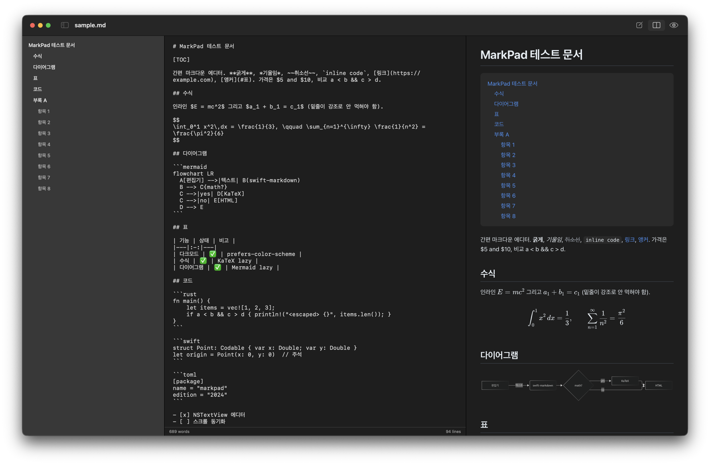

# MarkPad

[](https://github.com/cycorld/markpad/actions/workflows/ci.yml)
[](https://github.com/cycorld/markpad/releases/latest)
[](LICENSE)

A small native markdown editor for macOS: edit on the left, live preview on the right. SwiftUI + `NSTextView` + `WKWebView`, no Electron.

macOS용 간편 마크다운 에디터. 왼쪽 편집, 오른쪽 실시간 미리보기.



## Features

- **Editor** — `NSTextView`: monospaced, smart quotes/dashes/autocorrect off, find bar (⌘F), undo
- **Preview** — `WKWebView` with GitHub-flavoured styling, follows system dark mode, keeps scroll position while typing
- **Markdown** — Apple [swift-markdown](https://github.com/swiftlang/swift-markdown) (CommonMark + GFM tables, strikethrough, task lists)
- **Math** — `$inline$` and `$$display$$` via KaTeX (Pandoc/Obsidian rules: no space after the opening `$`, `\$` is a literal dollar, code is never touched)
- **Diagrams** — ```` ```mermaid ```` blocks via Mermaid, dark theme aware
- **Code** — fenced blocks with a language are highlighted by highlight.js (GitHub light/dark themes); languages outside the common bundle load on demand
- **Table of contents** — a paragraph containing just `[TOC]` (or `[[toc]]`) becomes a nested list of the document's headings; every heading gets a GitHub-style anchor id, so `[link](#section)` works
- **Outline sidebar** — ⌥⌘S lists the headings; click one to jump both the editor and the preview
- **Print & PDF** — ⌘P prints the rendered preview through the normal print panel; ⌥⌘P exports a PDF. Header and footer are configurable in Settings (⌘,) with `{title}` `{file}` `{page}` `{pages}` `{date}` `{time}` tokens and four page-number styles. Paper size and orientation come from Page Setup (⇧⌘P)
- **Documents** — New / Open / Save / autosave / window restoration; owns `.md` `.markdown` `.mdown` `.mkd`
- **View modes** — Editor (⌘1) · Split (⌘2) · Preview (⌘3)
- **Local images** — paths relative to the document work (served through a `markpad://` URL scheme handler, no private API)
- KaTeX, Mermaid and highlight.js are bundled but loaded lazily — a document only pays for what it uses

## Install

Grab `MarkPad-vX.Y.Z.zip` from the [latest release](https://github.com/cycorld/markpad/releases/latest), unzip, drag `MarkPad.app` to `/Applications`. The app is ad-hoc signed and not notarized, so the first launch needs right-click → Open (or `xattr -d com.apple.quarantine /Applications/MarkPad.app`). Requires macOS 14 or newer.

## Build from source

Requires Xcode 16+ (Swift 5.9 toolchain) and macOS 14+.

```bash
./build.sh            # → dist/MarkPad.app (ad-hoc signed)
./build.sh --install  # also copies it to /Applications
```

The first build generates the app icon (`Scripts/make-icon.swift`) and downloads pinned KaTeX/Mermaid/highlight.js builds (`Scripts/fetch-vendor.sh`) into `Assets/`.

To make MarkPad the default app for `.md` files: Finder → Get Info on any `.md` → Open With → MarkPad → Change All.

### Headless PDF export

```bash
/Applications/MarkPad.app/Contents/MacOS/MarkPad --export-pdf notes.md notes.pdf
```

Renders the file with the same pipeline as ⌘P (header/footer settings included) and exits. Set `MARKPAD_DEBUG=1` to trace the pipeline on stderr.

## Layout

```
Sources/MarkPad/
  MarkPadApp.swift              DocumentGroup entry point, view-mode menu
  AppDelegate.swift             closes the stray blank "Untitled" window DocumentGroup opens at launch
  MarkdownDocument.swift        FileDocument (UTF-8 text)
  EditorView.swift              outline / editor / preview layout, toolbar, debounced render
  OutlineView.swift             heading sidebar
  MarkdownTextView.swift        NSTextView wrapper
  PreviewView.swift             WKWebView wrapper (shell loads once, body swapped via JS)
  PreviewTemplate.swift         HTML shell, CSS (screen + print), lazy KaTeX/Mermaid/highlight.js loader
  MarkdownRenderer.swift        markdown → HTML pipeline
  HTMLRenderer.swift            AST → HTML with escaping, unique heading ids, heading list (derived from swift-markdown)
  MathProtector.swift           lifts $…$ spans out before parsing, splices them back after
  LocalFileSchemeHandler.swift  markpad:///abs/path → local file
  PrintController.swift         WebKit pagination → PDF → pages drawn with header/footer → print panel / file
  PrintOptions.swift            header / footer templates, page-number styles (UserDefaults)
  PrintSettingsView.swift       Settings → Print
Scripts/                        make-icon.swift, fetch-vendor.sh
build.sh                        assembles the .app bundle
```

## Contributing

Issues and pull requests are welcome — see [CONTRIBUTING.md](CONTRIBUTING.md). Please follow the [Code of Conduct](CODE_OF_CONDUCT.md). Security problems: [SECURITY.md](SECURITY.md). Changes are tracked in [CHANGELOG.md](CHANGELOG.md).

## License

MIT — see [LICENSE](LICENSE). Third-party components and their licenses are listed in [THIRD_PARTY.md](THIRD_PARTY.md).
